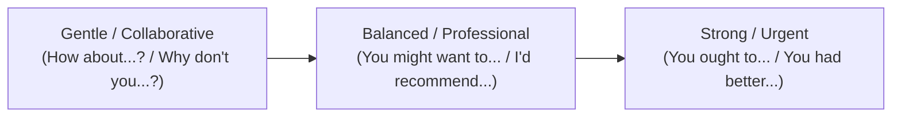

# Day 57 : Giving Advice, Suggestions & Recommendations

## 📚 Overview
Offering advice or making suggestions effectively requires matching the degree of assertiveness to the relationship, context, and problem complexity. If you are too authoritative, your suggestion can sound patronizing or bossy; if you are too tentative, your idea may be overlooked. Today, we break down the functional continuum of recommendations—from casual brain-storming hooks (*"How about..."*) to respectful professional recommendations (*"You might want to consider..."*) and firm moral or technical directives (*"You had better..."*).

---

## 🎯 Learning Objectives
By the end of this lesson, you will be able to:
- Choose the appropriate grammatical structure and tone across three levels of strength: gentle suggestions, balanced recommendations, and urgent/strong counsel.
- Correctly apply verb forms after phrases like *“Why don't we / you…”* (bare infinitive), *“How about…”* (gerund), and *“I recommend…”* (subjunctive / gerund).
- Avoid common pitfalls such as confusing *“should”* vs. *“had better”* (implying negative consequences).
- Formulate diplomatic advice in workplace contexts without sounding presumptuous.

---

## 📖 Theoretical Breakdown

### 1. The Advice & Suggestion Spectrum

| Strength Level | Structure / Formula | Grammatical Verb Form | Realistic Example | Tone / Nuance |
| :--- | :--- | :--- | :--- | :--- |
| **Exploratory & Casual** | **How about / What about** | + Gerund (`V-ing`) or Noun | "How about **grabbing** lunch outside?" | Casual, open-ended ideation |
| **Collaborative / Gentle** | **Why don't you / we** | + Bare Infinitive (`V1`) | "Why don't you **take** a short walk to clear your head?" | Non-intrusive, friendly invitation |
| **Professional / Soft** | **You might want to / could** | + Base Verb (`V1`) | "You might want to **double-check** the client's time zone." | Respectful advisory, preserves listener autonomy |
| **Standard Advisory** | **Should / Ought to** | + Base Verb (`V1`) | "You should **back up** your repository before migrating." | Sensible standard practice |
| **Formal Recommendation** | **I recommend / suggest** | + Gerund OR + `that` + bare infinitive | "I recommend **scheduling** a debrief." / "I suggest that he **submit** the ticket." | Formal, expert evaluation |
| **Urgent Warning** | **Had better ('d better)** | + Bare Infinitive (`V1`) | "You'd better **submit** the tax forms today, or there will be a penalty." | Implies negative consequences if ignored |

---

### 2. High-Frequency Grammatical Traps

#### Trap A: The "Suggest" & "Recommend" Pattern
Many English learners incorrectly say:
- ❌ *Incorrect:* "I recommend you to take a break."
- ❌ *Incorrect:* "She suggested me to buy the ticket."

Use either of these two correct patterns:
1. **Verb + Gerund:**
   - ✅ *"I recommend **taking** a break."*
2. **Verb + (that) + Subject + Subjunctive (base verb):**
   - ✅ *"I recommend (that) you **take** a break."*
   - ✅ *"She suggested (that) he **consult** a specialist."* (Notice: *consult*, not *consults*!)

#### Trap B: "Had better" is NOT the past tense of "good"
- *"You had better..."* (contracted: *You'd better*) functions as an urgent present/future modal indicating severe consequences:
  - *"You'd better hurry, or you will miss the train."*
  - Using *"had better"* for small casual suggestions (*"You had better eat an apple"*) can sound unexpectedly threatening.

#### Trap C: "How about" vs. "Why don't you"
- **How about** takes the **-ing** form: *"How about **calling** him?"*
- **Why don't you** takes the **bare infinitive**: *"Why don't you **call** him?"*

---

### 3. Diplomatic Framing Techniques for the Workplace

When speaking to a peer, client, or superior, soften direct advice using perspective-framing cushions:
- **"If I were in your position, I might..."**
- **"Have you thought about / considered..."** + `V-ing`
  - *"Have you considered renegotiating the delivery date?"*
- **"One possibility worth exploring is..."** + `V-ing`
  - *"One possibility worth exploring is running an A/B test first."*

---

## 💬 Conversational Dialogue

**Context:** Maya (Software Architect) and Julian (Junior Developer) are troubleshooting performance issues in an e-commerce API.

- **Julian:** "Maya, the user checkout endpoint is taking almost three seconds under load. I'm thinking of spinning up five more server instances immediately."
- **Maya:** "That might temporarily alleviate the latency, but it would skyrocket our cloud costs. Have you considered profiling the database queries first?"
- **Julian:** "I haven't done that yet. I assumed the database was optimized."
- **Maya:** "Why don't you run an `EXPLAIN ANALYZE` on the primary cart query? Often, an unindexed foreign key is the culprit."
- **Julian:** "That makes total sense. I'll test that right now."
- **Maya:** "Great. You might also want to implement Redis caching for the product pricing table if the queries turn out to be read-heavy."
- **Julian:** "Good call. Should I deploy the changes straight to staging?"
- **Maya:** "You'd better run the full integration test suite locally before pushing to staging—we have QA doing regression tests on staging all afternoon."
- **Julian:** "Understood. Thanks for pointing me in the right direction!"

---

## ✍️ Practice Exercises

### Exercise 1: Structural Fill-in-the-Blank
Complete each sentence with the correct form of the verb in parentheses:
1. How about (meet) ________________ for a coffee after the stand-up?
2. Why don't we (ask) ________________ the designer for updated assets?
3. I strongly suggest that she (be) ________________ present during the client walkthrough.
4. Have you thought about (automate) ________________ this backup script?
5. You'd better (save) ________________ your project before updating your operating system.

### Exercise 2: Appropriateness & Register Selection
Choose the most tactful and appropriate recommendation for each scenario:
1. **Scenario:** Recommending a course of action to your department manager.
   - (A) "You had better approve our budget now."
   - (B) "You might want to review the revised budget breakdown when your schedule permits."
2. **Scenario:** Recommending a casual weekend activity to a friend.
   - (A) "I propose that you implement an excursion to the museum."
   - (B) "How about checking out the new modern art exhibit this Saturday?"

---

## 🔑 Self-Check Answer Key

### Exercise 1:
1. **meeting** (*How about + gerund*)
2. **ask** (*Why don't we + bare infinitive*)
3. **be** (*Subjunctive base verb after suggest that*)
4. **automating** (*Have you thought about + preposition + gerund*)
5. **save** (*Had better + bare infinitive*)

### Exercise 2:
1. **(B)** *(A)* sounds confrontational and threatening to a manager, while *(B)* is polite, respectful of autonomy, and professional.
2. **(B)** *(A)* is excessively stiff and bureaucratic; *(B)* is natural and conversational.

---

## 💡 Practical Tip for Daily Practice
> **The Autonomous Choice Rule:** When advising peers or superiors, phrase your suggestion as an invitation to consider an option rather than an order. Replace *"You should do X"* with *"Have you thought about X?"* or *"You might want to explore X."* People are significantly more receptive to advice when they feel the ultimate decision remains entirely theirs.
