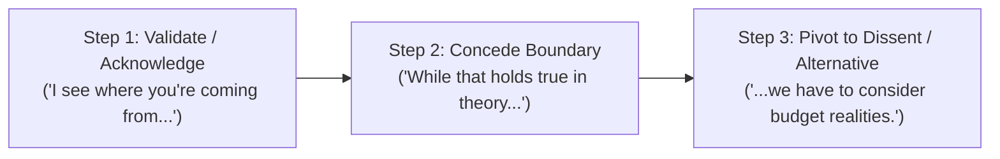

# Day 58 : Expressing Agreement & Polite Disagreement

## 📚 Overview
Navigating discussions, debates, and professional negotiations requires the ability to express consensus without sounding passive, and dissent without sounding combative. In native English discourse, outright blunt contradiction (*"You are wrong," "That makes no sense"*) can rupture collaboration. Masterful communicators use partial agreement, concessive clauses (*"while," "although," "up to a point"*), and pivot transitions (*"I see your point, but..."*) to keep dialogue constructive, analytical, and respectful.

---

## 🎯 Learning Objectives
By the end of this lesson, you will be able to:
- Express strong, neutral, and partial agreement with precision and confidence.
- Master the **3-Step Polite Disagreement Blueprint**: Validate ➔ Concede/Limit ➔ Pivot to Alternative.
- Use nuanced concessive markers such as *“Up to a point,” “To a certain extent,”* and *“While I appreciate that…”*.
- Counter opposing arguments persuasively while maintaining emotional equilibrium and professional rapport.

---

## 📖 Theoretical Breakdown

### 1. The Spectrum of Agreement

| Level of Agreement | Key Expressions | Usage Context & Collocations |
| :--- | :--- | :--- |
| **Complete / Strong** | - "I couldn't agree more." - "Spot on!" / "Precisely." - "You've hit the nail on the head." - "I'm entirely of the same mind." | Used when you endorse a proposal without reservation. Note: *"I couldn't agree more"* means maximum agreement, not disagreement! |
| **Neutral / Qualified** | - "I agree in principle." - "That sounds like a fair point." - "I concur with that assessment." | Agrees with the overall concept, reserving judgment on practical implementation details. |
| **Partial Agreement** | - "I agree up to a point, but..." - "To a certain extent, yes, however..." - "That's true in some cases, although..." | Acknowledges merit in a specific slice of the argument while opening room for crucial caveats. |

---

### 2. The 3-Step Polite Disagreement Blueprint

#### Step 1: The Validation Cushion
Never jump straight into "No". Validate the speaker's perspective or intent:
- *"I see your point..."*
- *"I understand where you're coming from..."*
- *"That is a well-founded perspective..."*

#### Step 2: The Concessive Bridge
Establish the boundary of their idea:
- *"Up to a point, that is definitely true..."*
- *"In an ideal scenario, that would make sense..."*
- *"While that worked well during the initial pilot..."*

#### Step 3: The Pivot & Counter-Evidence
Introduce your counterpoint using measured adversative transitions:
- *"...however, looking at our current burn rate, we cannot sustain it."*
- *"...that said, we might be underestimating user friction."*
- *"...on the flip side, what happens if our server load doubles?"*

---

### 3. Diplomatic Disagreement Formulas to Avoid Common Friction

| Avoid (Confrontational / Abrupt) | Use Instead (Diplomatic & Solution-Focused) |
| :--- | :--- |
| "You're wrong about that." | "I see things a bit differently on that front." |
| "That won't work." | "I'm not entirely convinced that approach is viable given our timeframe." |
| "I disagree completely." | "I have some reservations regarding that strategy." |
| "No, that's impossible." | "I suspect we might run into significant logistical hurdles there." |

---

### 4. Idiomatic Expressions in Debate & Discussion
- **"To play devil's advocate":** To argue an opposing viewpoint purely to test the strength of the original idea (*"Allow me to play devil's advocate for a moment: what if the competitor cuts prices first?"*).
- **"Agree to disagree":** A polite consensus to end an unresolvable debate without bitterness (*"We may have to agree to disagree on the visual branding for now."*).
- **"On the same page":** In agreement regarding goals and steps (*"Let's make sure engineering and sales are on the same page before Friday's demo."*).

---

## 💬 Conversational Dialogue

**Context:** Clara (Head of Marketing) and David (Chief Product Officer) debate whether to release a major software update early.

- **Clara:** "David, our main competitor is launching their autumn campaign in two weeks. I strongly believe we should push our release date up by ten days so we can steal the media spotlight."
- **David:** "I definitely see your point, Clara; capturing that market momentum would be fantastic for our brand visibility."
- **Clara:** "Exactly! First-mover advantage is huge in this category."
- **David:** "I agree up to a point, but rushing deployment means skipping two full regression cycles. I have serious reservations about putting out an unstable build just to beat their press release."
- **Clara:** "Can't QA just work overtime through the weekend?"
- **David:** "To a certain extent they could, but that still doesn't give us enough bandwidth to stress-test the new payment gateway. If checkout fails on launch day, any marketing buzz will immediately backfire."
- **Clara:** "Fair enough; I hadn't weighed the risk to payment processing as heavily. What if we launch a teaser campaign instead, keeping the original launch date intact?"
- **David:** "Spot on! That gives marketing early buzz without jeopardizing software stability. Let's do that."

---

## ✍️ Practice Exercises

### Exercise 1: Diplomatic Reframing
Rewrite each blunt contradiction into a 3-step diplomatic disagreement (Validation ➔ Concession ➔ Pivot).
1. *Blunt:* "Your pricing strategy is way too high."
2. *Blunt:* "We shouldn't hire a remote worker; they never do any work."
3. *Blunt:* "This user interface is ugly."

### Exercise 2: Multiple Choice Agreement Nuance
Identify which sentence conveys **maximum agreement**:
1. (A) "I agree up to a point."
2. (B) "I couldn't agree more."
3. (C) "I agree in principle."
4. (D) "I see what you mean."

---

## 🔑 Self-Check Answer Key

### Exercise 1: Sample Model Responses
1. *"I understand where you're coming from regarding premium positioning; however, I'm concerned this price point might price out our core early-adopter demographic."*
2. *"I see your point about maintaining close team alignment; that said, opening up our search to remote candidates would allow us to access world-class specialized talent."*
3. *"I appreciate the minimalist direction you're aiming for; however, the color palette and typography feel somewhat flat—perhaps we could inject more brand contrast?"*

### Exercise 2:
**Correct Answer: (B) "I couldn't agree more."**
- Explanation: The phrase literally means "It is impossible for me to agree any more than I already do," signifying 100% agreement.

---

## 💡 Practical Tip for Daily Practice
> **The 'Yes, AND' Pivot:** In meetings, replace the reflexive impulse to say *"No, but..."* with *"Yes, and have you considered..."* or *"I see your point, and on top of that, we must factor in..."*. Validating before building makes the other person feel heard and keeps collaborative dialogue fluid and constructive.
