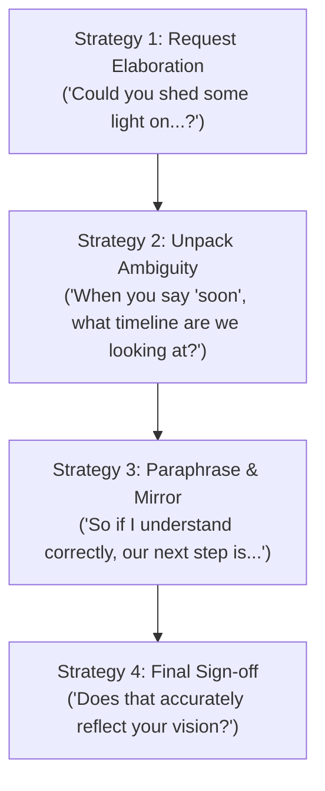

# Day 59 : Clarification & Confirmation Strategies

## 📚 Overview
Misunderstandings in professional environments cost time, money, and trust. High-performing communicators do not pretend to understand ambiguous instructions; instead, they proactively deploy **clarification techniques** (asking for more detail) and **confirmation strategies** (paraphrasing back to verify alignment). Today’s lesson equips you with natural linguistic patterns to ask for elaboration, unpack buzzwords, and mirror critical takeaways without sounding confused or incompetent.

---

## 🎯 Learning Objectives
By the end of this lesson, you will be able to:
- Distinctly differentiate between asking for **clarification** (seeking more information) and asking for **confirmation** (verifying your understanding).
- Paraphrase complex instructions using mirroring stems (*"If I understand correctly," "So what you're essentially saying is..."*).
- Request deeper elaboration politely using open-ended inquiries (*"Could you walk me through..."*, *"What do you mean by..."*).
- Handle noisy audio, fast speech, or technical jargon with poise and professionalism.

---

## 📖 Theoretical Breakdown

### 1. Clarification vs. Confirmation

| Function | Objective | When to Use | Key Phrase Stems |
| :--- | :--- | :--- | :--- |
| **Clarification** | To extract missing details, definitions, or procedural steps. | When the message is vague, incomplete, or contains unfamiliar jargon. | - *"Could you elaborate on what you mean by...?"* - *"Could you unpack that concept for us?"* - *"What does that look like in practice?"* |
| **Confirmation** | To verify that your interpretation matches the speaker's true intent. | Before committing to action, closing a meeting, or signing off on specs. | - *"If I'm following you correctly, we should..."* - *"Just to ensure we're aligned, are you saying...?"* - *"So in other words, our main priority is...?"* |

---

### 2. The 4 Core Strategies of Master Facilitators

#### Strategy 1: Requesting Elaboration
When an idea is too high-level:
- *"Could you elaborate on how this impacts our current sprint?"*
- *"Could you walk me through the logic behind that calculation?"*
- *"Could you give us a concrete example of that scenario?"*

#### Strategy 2: Pinning Down Ambiguity & Technical Jargon
When deadlines or concepts are fuzzy:
- *"When you say 'streamlined', which specific steps are we eliminating?"*
- *"Just to clarify, what timeline do you have in mind when you say 'as soon as feasible'?"*
- *"Could you clarify what metric we are using to define 'success' here?"*

#### Strategy 3: Paraphrasing (Active Listening Mirror)
Paraphrasing prevents execution errors by stating the directive in your own words:
- *"Correct me if I'm wrong, but are you proposing that we delay the beta release until security audits conclude?"*
- *"So, boiling that down to immediate action items: team A finishes the mockup by Wednesday, and team B begins backend integration on Thursday?"*

#### Strategy 4: The Sanity Check / Alignment Verification
Close the loop by inviting correction:
- *"Does that capture what you had in mind?"*
- *"Am I on the right track, or did I miss a nuance?"*
- *"Is that an accurate summary of our conclusion?"*

---

### 3. Dealing with Acoustic & Linguistic Breakdowns

If you didn't hear someone due to audio lag, background noise, or rapid speech:
- ❌ *Avoid:* "What?" or "Huh?" (Rude / unprofessional).
- ✅ *Use:* "Sorry, the audio broke up for a second. Could you repeat that last point?"
- ✅ *Use:* "Would you mind saying that once more? I want to make sure I don't miss anything critical."
- ✅ *Use:* "I didn't quite catch the figure for the European market. Could you run through that once more?"

---

## 💬 Conversational Dialogue

**Context:** Nina (Client Success Lead) and Tariq (Lead Systems Architect) are finalizing client onboarding requirements.

- **Nina:** "Tariq, the client says they need full zero-trust architecture integrated seamlessly by next Friday, but they don't want any downtime for legacy users."
- **Nina:** "Could you unpack what that implies technically? It sounds fairly ambitious."
- **Tariq:** "Well, technically we can bridge their directory services with OAuth, but zero downtime while deprecating basic auth in five days is risky."
- **Nina:** "If I understand correctly, the security protocol is doable, but the five-day deadline creates a high risk of service interruption for active users. Is that right?"
- **Tariq:** "Exactly. That's spot on."
- **Nina:** "What do you mean by 'risky' in terms of user experience? What would happen if an edge case fails?"
- **Tariq:** "Users on outdated mobile apps would get locked out and have to reset their session credentials through customer support."
- **Nina:** "Got it. So just to confirm our path forward: we should recommend a phased rollout over three weeks rather than a hard cutover next Friday. Does that sound like a prudent compromise?"
- **Tariq:** "That hits the nail right on the head. Let's pitch that phased timeline to their CTO."

---

## ✍️ Practice Exercises

### Exercise 1: Formulating Clarification & Confirmation Questions
Write an appropriate clarification or confirmation phrase for each prompt:
1. Your manager says: *"We need to optimize the database immediately."* Ask for specific details on what needs optimization.
2. A client explains a complex 4-step deployment process. Paraphrase their instructions starting with *"If I'm following you correctly..."*.
3. A teammate's voice breaks up on a Zoom call during the budget discussion. Ask them politely to repeat the dollar amount.

### Exercise 2: Matching Intent to Structure
Match each communicative intent to the best phrasing:
- (A) "Could you elaborate on that?"
- (B) "If I'm hearing you correctly, we are pivoting to B2B?"
- (C) "What exactly do you mean by 'scalable' in this context?"

1. Defining an ambiguous buzzword: ________
2. Paraphrasing a strategic shift: ________
3. Asking for more context on an idea: ________

---

## 🔑 Self-Check Answer Key

### Exercise 1: Sample Model Responses
1. *"Could you elaborate on which specific tables or endpoints are experiencing bottlenecks, so we know where to focus our optimization?"*
2. *"If I'm following you correctly, we first duplicate the staging database, migrate the schema, run the smoke tests, and only then flip the DNS records. Is that accurate?"*
3. *"Sorry, your connection broke up for a second there. Could you repeat the budget figure you mentioned?"*

### Exercise 2:
1. **(C)** – Unpacking buzzword ambiguity.
2. **(B)** – Paraphrasing and confirming strategy.
3. **(A)** – Requesting elaboration.

---

## 💡 Practical Tip for Daily Practice
> **The 'Echo' Technique in Meetings:** Whenever you receive multi-step verbal tasks or vague directives, immediately summarize them with: *"Just to make sure we're 100% aligned, let me play that back to you..."*. This single habit saves countless hours of rework and instantly establishes you as an organized, dependable professional.
