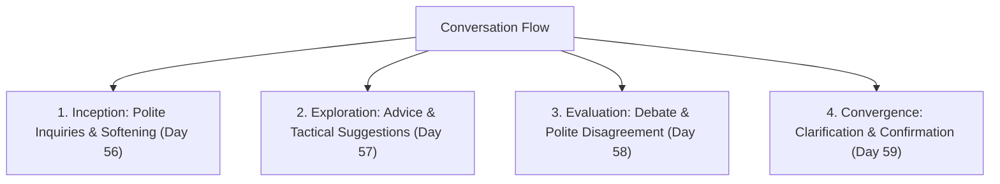

# Day 60 : Mid-Course Milestone Review & Comprehensive Fluency Quiz

## 📚 Overview
Congratulations on reaching the **60% milestone** of your 100-day English mastery journey! Over the past ten days, you transitioned from intermediate sentence construction into executive-level communicative competence: softening directives, dispensing nuanced recommendations, disagreeing respectfully, and verifying intent through precision mirroring. Today’s milestone lesson provides a systematic synthesis of these conversational pillars, diagnosing your strengths and cementing the habits required for native-level fluency.

---

## 🎯 Learning Objectives
By the end of this review milestone, you will:
- Seamlessly integrate diplomatic hedging, advice frameworks, agreement spectrums, and confirmation tactics in real-time discourse.
- Identify and eliminate subconscious speech errors that create friction or social awkwardness.
- Synthesize multiple conversational modules into fluid multi-turn stakeholder interactions.
- Measure your practical retention with a comprehensive 5-question milestone assessment.

---

## 📖 Theoretical Breakdown

### 1. The Executive Communicator's Matrix (Days 56–59 Synthesis)

| Conversational Stage | Core Objective | High-Impact Anchor Phrases | Critical Grammatical Rule |
| :--- | :--- | :--- | :--- |
| **1. Softened Request / Opening** | Initiate dialogue without imposing | - *"I was wondering if you might have..."* - *"Would you mind taking a look...?"* | `Would you mind` + gerund (`V-ing`); indirect clauses retain declarative word order. |
| **2. Collaborative Advisory** | Guide decisions without being prescriptive | - *"Why don't we test...?"* - *"How about benchmarking...?"* - *"You might want to consider..."* | `Why don't we` + bare infinitive; `How about` + gerund; `suggest that` + base subjunctive. |
| **3. Diplomatic Dissent** | Challenge assumptions constructively | - *"I see where you're coming from, but..."* - *"I agree up to a point, however..."* - *"I have some reservations regarding..."* | The 3-Step formula: Validate ➔ Concede boundary ➔ Pivot to counterpoint with objective data. |
| **4. Alignment & Sign-off** | Prevent costly misunderstandings | - *"Could you unpack what you mean by...?"* - *"If I understand correctly, our next step is..."* - *"Does that reflect what you had in mind?"* | Paraphrasing / active listening mirror ensures mutual accountability before action. |

---

### 2. High-Frequency Pitfall Audit: Before & After

| The Common Slip-up | Why It Falters | The Executive Standard |
| :--- | :--- | :--- |
| ❌ "I recommend you to change this." | Incorrect syntax pattern with *recommend*. | ✅ *"I recommend **changing** this"* OR *"I recommend that you **change** this."* |
| ❌ "Would you mind to email me?" | Gerund required after *mind*. | ✅ *"Would you mind **emailing** me?"* |
| ❌ "I couldn't agree more with you... wait, I disagree." | Confusing meaning of *couldn't agree more*. | ✅ *"I couldn't agree more"* = 100% agreement. For dissent: *"I see your point, but I have reservations."* |
| ❌ "You had better take lunch now." | *Had better* implies imminent negative danger. | ✅ *"Why don't you grab some lunch?"* or *"You might want to take a breather."* |
| ❌ "What? I didn't hear." | Perceived as blunt or impatient. | ✅ *"Sorry, the audio lagged for a second; could you repeat that last detail?"* |

---

## 💬 Conversational Dialogue: Multi-Turn Executive Meeting

**Context:** A cross-functional quarterly roadmap review between Sarah (VP of Product), Liam (Tech Lead), and Zoe (Operations Director).

- **Sarah:** "Good afternoon, team. I was wondering if we could kick off with the mobile checkout overhaul. Liam, do you have the initial latency benchmarks?"
- **Liam:** "Yes, Sarah. The new microservice architecture cuts server round-trips by roughly 40%."
- **Zoe:** "That sounds promising in principle. However, I have some reservations regarding our customer support team's readiness. If we migrate all users in one batch, our support queue will be swamped."
- **Sarah:** "I see your point, Zoe; maintaining customer trust during the migration is paramount. Liam, how about running a canary release with just 5% of users over the first week?"
- **Liam:** "That's a very sensible compromise. In fact, why don't we roll it out exclusively to our beta opt-in users first? That way, we insulate mainstream users from any edge-case bugs."
- **Zoe:** "Spot on! That completely alleviates my operational concerns."
- **Sarah:** "Excellent. Just to make sure we're all on the same page: Liam will configure the 5% beta rollout by Wednesday, and Zoe will brief customer support by Thursday morning. Does that capture everyone's expectations?"
- **Liam & Zoe:** "Precisely. Let's make it happen."

---

## ✍️ Practice Exercises

### Comprehensive Synthesis Challenge
Fill in the blanks using the appropriate target structures learned across Days 56–59:
1. *(Softened request)* I was ________________ if you could spare ten minutes to look over this clause.
2. *(Advice)* Why don't we ________________ (schedule) an ad-hoc sync tomorrow morning?
3. *(Partial agreement)* I agree with your assessment ________________ a point, but we must account for inflation.
4. *(Recommendation with subjunctive)* The auditor recommended that the CFO ________________ (re-evaluate) the balance sheet.
5. *(Active listening confirmation)* If I'm ________________ you correctly, we are putting the European expansion on hold until Q3?

---

## 🔑 Self-Check Answer Key

1. **wondering** (*"I was wondering if..."*)
2. **schedule** (*bare infinitive after "Why don't we"*)
3. **up to** (*"up to a point"*)
4. **re-evaluate** (*mandative subjunctive base verb after "recommended that"*)
5. **following** (*"If I'm following you correctly..."*)

---

## 💡 Practical Tip for Daily Practice
> **The 60-Day Habit Tracker:** You are now past the halfway mark of your 100-day fluency journey! Record a 2-minute voice memo on your phone simulating a meeting where you: (1) make a polite request, (2) offer a recommendation, (3) partially disagree with an assumption, and (4) confirm the final action item. Listen back to evaluate your pace, intonation, and natural use of softening markers.
