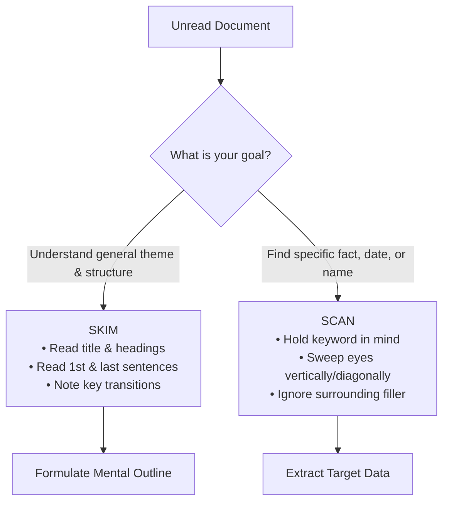

# Day 61 : Reading Comprehension: Skimming vs. Scanning Strategies

## 📚 Overview
Fluent readers do not read every text in the same uniform manner. Reading every word at 150 words per minute when searching for a flight departure time or reviewing a 60-page regulatory report is inefficient. Advanced English literacy demands cognitive flexibility through **skimming** (rapidly reading to extract the central gist, structure, and tone) and **scanning** (rapidly searching for specific target details such as dates, numbers, names, or keywords). Today’s lesson explores both reading mechanics through our featured micro-story: *The Forgotten Invention*.

---

## 🎯 Learning Objectives
By the end of this lesson, you will be able to:
- Distinctly differentiate the cognitive objectives, eye-movement mechanics, and application zones of skimming versus scanning.
- Execute a **30-second skim** to deduce the central thesis, genre, and trajectory of an unfamiliar text.
- Execute a **targeted scan** to pinpoint discrete facts, dates, proper nouns, and numerical values without subvocalizing entire paragraphs.
- Apply strategic reading techniques to academic exams (IELTS/TOEFL) and corporate reading workloads.

---

## 📖 Theoretical Breakdown

### 1. Skimming vs. Scanning Comparative Matrix

| Dimension | Skimming (Gist Reading) | Scanning (Targeted Search) |
| :--- | :--- | :--- |
| **Primary Goal** | Understand the big picture, topic, main argument, and flow. | Locate a specific piece of information (date, name, figure, term). |
| **Reading Speed** | 400 – 700 words per minute (WPM). | 1,000+ words per minute (rapid visual sweeps). |
| **Eye Movement Pattern** | Horizontal 'S' curves across headings, first and last sentences of paragraphs. | Vertical or diagonal scanning, zigzagging down the page searching for typographical anchors (capital letters, digits, quotes). |
| **Cognitive Focus** | Topic sentences, transition words (*however, therefore*), concluding summaries. | Pre-determined keywords, numerals, symbols, or bold/italicized terms. |
| **Typical Use Case** | Deciding if an article is relevant, previewing book chapters, reviewing memos. | Looking up a train schedule, locating a phone number, finding a reference in legal terms. |

---

### 2. The Mechanics of Skimming
1. **The F-Pattern Sweep:** Eyes naturally track across the headline, the first few lines of the introductory paragraph, and then travel vertically down the left margin, catching subheading anchors and the first clause of subsequent paragraphs.
2. **Subvocalization Suppression:** In standard reading, your internal voice pronounces each word silently. When skimming, deliberately suppress this inner voice. Focus on pattern-matching ideas rather than vocalizing phonemes.
3. **Anchor Clues:** Watch for discourse markers that signal turning points: *In summary, Crucially, Conversely, Consequently, Most importantly*.

---

### 3. The Reading Passage: *The Forgotten Invention*

> **Paragraph 1:**  
> In the damp autumn of 1928, nestled inside a cluttered workshop on the outskirts of Prague, an eccentric horologist named Viktor Hladík assembled what he designated the *Chronographia Universalis*. Unlike the conventional mechanical clockwork of his era, which relied strictly on coiled springs and escapement wheels, Viktor’s device incorporated calibrated mercury reservoirs and thermal expansion brass coils. He hypothesized that ambient temperature shifts could power perpetual precision timekeeping without manual winding.
>
> **Paragraph 2:**  
> By the spring of 1931, Hladík had drafted detailed schematics spanning 140 parchment folios. Yet, his timing could scarcely have been worse. The global economic devastation of the Great Depression forced European watchmaking guilds into austerity, leaving little appetite for unproven kinetic experiments. When the municipal patent office rejected his application on November 14, 1933—citing insufficient evidence of long-term stability—Viktor sealed the blueprints within a zinc-lined chest and secured it in the attic of St. Vitus Cathedral's archive tower.
>
> **Paragraph 3:**  
> For over six decades, the apparatus gathered dust in obscurity. It was not until October 1999 that Dr. Helena Vanečková, an archival conservator cataloging ecclesiastical manuscripts, pried open the corroded zinc lock. Inside, alongside the blueprints, lay the prototype itself. To her astonishment, despite enduring 66 years of freezing winters and sweltering Bohemian summers, the thermal pendulum was still oscillating at exactly 60 beats per minute. Modern metallurgists would later discover that Hladík’s mercury seal had achieved near-zero friction, anticipating modern self-regulating thermal dynamics by more than half a century.

---

## 💬 Conversational Dialogue

**Context:** Aaron (Language Coach) coaches Sofia (GRE/IELTS student) on speed-reading and reading comprehension techniques.

- **Sofia:** "Aaron, I keep running out of time on the reading section. By the time I finish the third paragraph, I have forgotten what the first paragraph was about!"
- **Aaron:** "That happens when you treat every single word with equal importance. Are you reading the whole passage before looking at the questions?"
- **Sofia:** "Yes, from the very first word to the last."
- **Aaron:** "That's why you're struggling with pacing. Let's practice the two-gear approach: skim the passage first in 40 seconds to map the layout, then scan for question keywords."
- **Sofia:** "So for *The Forgotten Invention*, how would you skim it?"
- **Aaron:** "Look at paragraph 1: *1928, Prague, Viktor Hladík, clockmaker, temperature-powered clock*. Paragraph 2: *1931, depression, patent rejected 1933, hidden in cathedral*. Paragraph 3: *1999, Helena finds it, still ticking, ahead of its time*. Boom—you have the narrative map in your head."
- **Sofia:** "And if the question asks: *On what exact date was his patent application denied?*..."
- **Aaron:** "You don't re-read paragraph 1 or 3! Your eyes scan down paragraph 2 looking for numbers and months: *November 14, 1933*. Instant answer, zero wasted mental energy."
- **Sofia:** "That feels almost like a superpower. It transforms reading from an endurance test into a search game."

---

## ✍️ Practice Exercises

### Exercise 1: Scanning Challenge (Speed Test)
Using the passage *The Forgotten Invention*, locate the exact answers to the following questions without reading line by line. Record your time in seconds:
1. What was the exact name of the invention in Latin?
2. How many folios made up Hladík's drafted schematics?
3. Where was the zinc-lined chest stored?
4. In what year was the chest discovered by Dr. Helena Vanečková?
5. How many beats per minute was the pendulum oscillating at when discovered?

### Exercise 2: Skimming Synthesis
In 1 to 2 sentences, summarize the central theme and ultimate significance of Viktor Hladík's story.

---

## 🔑 Self-Check Answer Key

### Exercise 1: Scanning Targets
1. **Chronographia Universalis** (Paragraph 1)
2. **140 parchment folios** (Paragraph 2)
3. **The attic of St. Vitus Cathedral's archive tower** (Paragraph 2)
4. **October 1999** (Paragraph 3)
5. **60 beats per minute** (Paragraph 3)

### Exercise 2: Skimming Synthesis
*Sample Summary:* Viktor Hladík engineered a pioneering self-powering thermal clock in 1928 that was dismissed due to economic hardship and bureaucratic doubt, only to be rediscovered decades later as a triumphant precursor to modern thermodynamics.

---

## 💡 Practical Tip for Daily Practice
> **The 20-Second Headline Preview:** Whenever you open a news website or technical article, give yourself exactly 20 seconds to read the title, the bold lead sentence, and the final concluding sentence. Write down your one-sentence prediction of the article's takeaway before reading further. This primes your working memory and boosts comprehension by over 35%.
