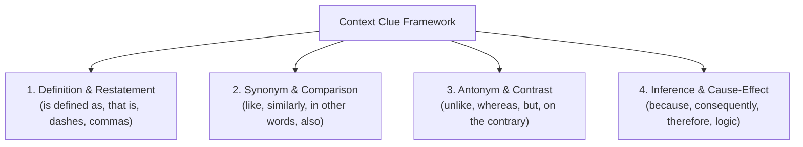

# Day 62 : Reading Comprehension: Contextual Vocabulary Clues

## 📚 Overview
When reading advanced academic, journalistic, or technical literature, you will inevitably encounter unfamiliar words. Halting your reading every paragraph to look up terms in a dictionary disrupts comprehension flow and taxes working memory. Highly fluent readers rely on **contextual vocabulary clues**—using the syntactic environment, surrounding punctuation, antonym contrasts, and semantic logic to infer word meanings on the fly. Today’s lesson explores the four primary types of context clues through the passage: *Urban Architecture in the 21st Century*.

---

## 🎯 Learning Objectives
By the end of this lesson, you will be able to:
- Identify and exploit the **4 primary categories of context clues**: Definition/Appositive, Synonym/Restatement, Antonym/Contrast, and Logic/Cause-and-Effect.
- Deduce the meanings of sophisticated architectural and urban planning terms (*biophilic, austere, monolithic, impervious, obsolescence*) purely from context.
- Spot grammatical signaling devices such as semicolons, dashes, appositives, and concessive transitions that frame unfamiliar words.
- Boost your vocabulary inference speed for standardized exams and high-level publications.

---

## 📖 Theoretical Breakdown

### 1. The 4 Types of Context Clues

| Clue Category | Mechanism / Punctuation Signals | Signaling Words | Illustrative Example |
| :--- | :--- | :--- | :--- |
| **1. Definition / Appositive** | The author explicitly defines the term in the same or adjacent clause, often set off by commas, dashes, or parentheses. | *is, refers to, means, that is, namely, which signifies* | *"The facade features **biophilic** design—an architectural approach that integrates living flora and natural sunlight into structural elements."* |
| **2. Synonym / Restatement** | A familiar word or explanatory phrase with a similar meaning is paired alongside the difficult term. | *like, also, similarly, as well as, or, in other words* | *"The district's **austere** concrete blocks, grim and unadorned, offered little visual comfort to pedestrians."* |
| **3. Antonym / Contrast** | The target word is contrasted with its opposite, revealing its meaning through negation. | *unlike, in contrast to, however, whereas, on the contrary, yet* | *"Unlike the **monolithic**, uniform skyscrapers of the 1970s, modern complexes showcase multifaceted, varied elevations."* |
| **4. Inference / Cause & Effect** | The meaning must be deduced from the logical causal relationships in the surrounding narrative. | *because, consequently, as a result, leading to, thus* | *"Because the asphalt surfaces were completely **impervious**, rainwater could not soak into the soil, triggering flash urban floods."* |

---

### 2. The Reading Passage: *Urban Architecture in the 21st Century*

> **Paragraph 1:**  
> Throughout the mid-twentieth century, urban planning was dominated by brutalist aesthetics: heavy, **austere** concrete slabs stripped of ornamentation, casting imposing silhouettes across metropolitan skylines. These **monolithic** edifices—colossal, unbroken towers that treated city blocks as uniform masses—prioritized industrial efficiency over human emotional resonance. For decades, city centers functioned as sterile conduits for vehicular transit rather than vibrant habitats for communal life.
>
> **Paragraph 2:**  
> In the twenty-first century, however, a profound paradigm shift has emerged. Architects are vigorously repudiating this legacy of gray permanence, embracing **biophilic** principles that deliberately weave living ecosystems, vertical forests, and natural airflow into residential and commercial footprints. Projects like Milan's *Bosco Verticale* demonstrate that skyscrapers need not stand in opposition to nature; instead, they can operate as **regenerative** systems that produce oxygen, filter micro-pollutants, and moderate microclimates.
>
> **Paragraph 3:**  
> Furthermore, municipal engineers are confronting the perilous consequence of **impervious** pavements. Traditional tarmac and dense cement prevent storm runoff from percolating naturally into subterranean aquifers, thereby aggravating urban heat islands and inundating sewer networks. To counteract structural **obsolescence**—the process by which buildings and materials become outdated, dysfunctional, and ecologically unviable—contemporary developers are adopting modular timber construction and permeable bio-swales. This ecological pivot ensures that tomorrow's metropolises are not merely durable monuments, but responsive, living organisms.

---

## 💬 Conversational Dialogue

**Context:** Liam (Architecture student) and Dr. Chen (Professor of Urban Studies) discuss vocabulary deciphering techniques.

- **Liam:** "Dr. Chen, when reading academic architectural journals, I keep bumping into words like *impervious* and *obsolescence*. It feels overwhelming."
- **Dr. Chen:** "Look at how the author built the sentence around *impervious*: *'Traditional tarmac and dense cement prevent storm runoff from percolating naturally into subterranean aquifers...'* What does tarmac do to water?"
- **Liam:** "It blocks it. Water can't pass through."
- **Dr. Chen:** "Exactly! The prefix *im-* means 'not', and the root relates to *pervade* or *pass through*. The cause-and-effect clue tells you immediately: *impervious* means impermeable, not allowing fluid to penetrate."
- **Liam:** "What about *obsolescence* in Paragraph 3?"
- **Dr. Chen:** "Notice the appositive dash right after it: *'—the process by which buildings and materials become outdated, dysfunctional, and ecologically unviable—'*. The author gave you the literal dictionary definition between the em-dashes!"
- **Liam:** "I never realized authors left so many signposts in their punctuation."
- **Dr. Chen:** "Good authors always plant structural clues. Train your eyes to read the sentence structure, not just the vocabulary."

---

## ✍️ Practice Exercises

### Exercise 1: Context Clue Identification
For each word from the passage, identify (A) its deduced meaning, and (B) the type of context clue used (Definition, Synonym, Antonym, or Cause/Effect).

1. **Austere** (Paragraph 1)
   - Meaning: ________________
   - Clue Type: ________________
2. **Monolithic** (Paragraph 1)
   - Meaning: ________________
   - Clue Type: ________________
3. **Biophilic** (Paragraph 2)
   - Meaning: ________________
   - Clue Type: ________________
4. **Impervious** (Paragraph 3)
   - Meaning: ________________
   - Clue Type: ________________
5. **Obsolescence** (Paragraph 3)
   - Meaning: ________________
   - Clue Type: ________________

---

## 🔑 Self-Check Answer Key

### Exercise 1:
1. **Austere**:
   - *Meaning:* Plain, harsh, unadorned, lacking decoration.
   - *Clue Type:* Synonym/Restatement (*"stripped of ornamentation"*).
2. **Monolithic**:
   - *Meaning:* Massive, uniform, indivisible, giant single structures.
   - *Clue Type:* Definition/Appositive (*"—colossal, unbroken towers that treated city blocks as uniform masses—"*).
3. **Biophilic**:
   - *Meaning:* Incorporating nature, living organisms, and plant life into human spaces.
   - *Clue Type:* Definition/Restatement (*"deliberately weave living ecosystems, vertical forests, and natural airflow..."*).
4. **Impervious**:
   - *Meaning:* Waterproof, not permitting penetration or passage of liquids.
   - *Clue Type:* Cause & Effect (*"prevent storm runoff from percolating naturally into subterranean aquifers"*).
5. **Obsolescence**:
   - *Meaning:* The state of becoming outdated, obsolete, or no longer useful.
   - *Clue Type:* Definition/Appositive set off by em-dashes (*"—the process by which buildings and materials become outdated, dysfunctional..."*).

---

## 💡 Practical Tip for Daily Practice
> **The Punctuation Radar:** Whenever you spot an unfamiliar noun or adjective while reading, scan immediately for three punctuation markers: (1) em-dashes (`—`), (2) parenthetical clauses (`(...)`), and (3) commas setting off appositives (e.g., *X, a type of Y, ...*). More than 60% of academic texts define specialized terms directly within these boundaries.
