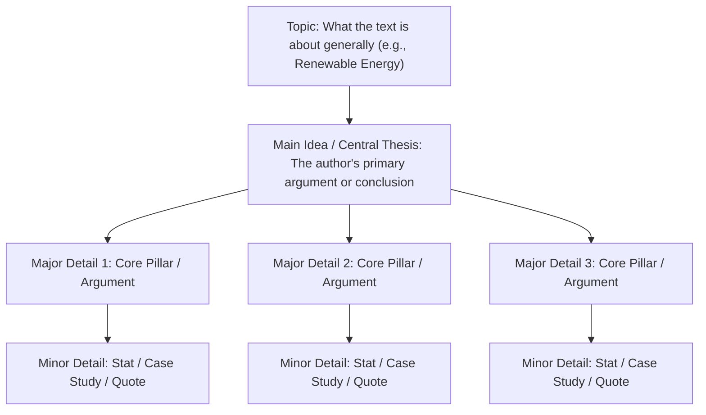

# Day 63 : Reading Comprehension: Identifying Main Idea vs. Supporting Details

## 📚 Overview
A frequent obstacle in advanced reading comprehension is confusing the **main idea** (the central claim or core thesis an author is defending) with **supporting details** (the empirical statistics, historical anecdotes, quotes, or secondary explanations used to substantiate that claim). Failing to separate the two leads to inaccurate summaries and wrong answers on standardized exams like TOEFL and IELTS. Today’s lesson introduces the **Umbrella Test** and structural hierarchy techniques through an informative analytical article: *Renewable Energy Transitions*.

---

## 🎯 Learning Objectives
By the end of this lesson, you will be able to:
- Distinctly differentiate the overarching **Topic**, the author's **Main Idea (Thesis)**, and subordinate **Supporting Details**.
- Apply the **Umbrella Test** to verify whether a candidate sentence encompasses all other statements in a paragraph.
- Distinguish major supporting details (primary reasons/pillars) from minor supporting details (data points, specific examples, parenthetical citations).
- Read dense scientific, policy, and economic literature with structural clarity.

---

## 📖 Theoretical Breakdown

### 1. The Comprehension Hierarchy

| Structural Level | What It Represents | Key Characteristic | How to Spot It |
| :--- | :--- | :--- | :--- |
| **Topic** | The general subject matter. | 1–3 words; broad and neutral. | Ask: *"What general topic is under discussion?"* (e.g., *Solar storage*). |
| **Main Idea (Thesis)** | The author's specific assertion or conclusion about that topic. | Complete declarative statement; holds the entire piece together. | Ask: *"What is the author's single most important point about this topic?"* |
| **Major Supporting Detail** | Primary reasons, arguments, or operational pillars supporting the thesis. | Direct sub-points; introduced by transitions (*firstly, in addition, moreover*). | Forms the topic sentence of body paragraphs. |
| **Minor Supporting Detail** | Granular data, percentages, quotes, historical dates, or illustrative examples. | Highly specific; serves only to validate a major detail. | Contains digits, proper names, study references (*for example, specifically*). |

---

### 2. The "Umbrella Test"
When choosing between multiple potential main-idea options:
- **Rule:** A valid main idea must act like an **umbrella**—wide enough to cover every supporting detail in the section, yet precise enough that it does not leak into unrelated topics.
- **Trap 1: Too Narrow:** An answer choice that accurately describes only one paragraph or data point (e.g., *"Lithium prices fell by 80%"*).
- **Trap 2: Too Broad:** An answer choice that spans beyond the author's actual scope (e.g., *"Human civilization needs energy"*).

---

### 3. The Reading Passage: *Renewable Energy Transitions*

> **Paragraph 1:**  
> The global transition toward decarbonized power generation cannot succeed through the mere installation of solar photovoltaic panels and wind turbines alone. While the plunging levelized cost of clean energy has driven record-breaking additions to national generation capacities, raw generation solves only half of the decarbonization equation. The true bottleneck in achieving an enduring clean energy economy lies in modernizing foundational grid infrastructure and deploying utility-scale energy storage to overcome renewable intermittency.
>
> **Paragraph 2:**  
> The foremost engineering hurdle is the fundamental mismatch between when renewable energy is generated and when consumer demand peaks. Solar output peaks predictably at midday, while electrical load surges during the early evening hours as households power appliances and charge electric vehicles. Without scalable grid-scale storage—such as lithium-iron-phosphate battery arrays, pumped-storage hydroelectricity, or emerging green hydrogen systems—excess midday power must be curtailed or wasted, leaving grids dependent on fossil-fuel peaker plants during evening spikes.
>
> **Paragraph 3:**  
> Furthermore, twentieth-century transmission architecture is poorly configured for geographically decentralized clean energy. Traditional power plants were erected near population centers; conversely, the most productive wind corridors and solar deserts are located hundreds of kilometers away in remote hinterlands. Upgrading high-voltage direct-current (HVDC) transmission lines and digitizing distribution grids requires estimated capital investments exceeding $600 billion annually through 2035. Ultimately, unless governments prioritize high-capacity transmission corridors and energy storage alongside renewable generation, the clean energy revolution will stall before reaching its net-zero destination.

---

## 💬 Conversational Dialogue

**Context:** Elena (Graduate Research Assistant) and Dr. Vance (Energy Policy Fellow) break down the article's core thesis.

- **Elena:** "Dr. Vance, if a test question asks: *What is the main idea of this article?*, would it be that *'Solar panels produce excess energy at midday'*?"
- **Dr. Vance:** "Think about the Umbrella Test, Elena. Does that midday solar detail cover Paragraph 3's discussion of high-voltage transmission lines?"
- **Elena:** "No, not at all! That's just an illustrative example of intermittency in Paragraph 2."
- **Dr. Vance:** "Exactly. That is a minor supporting detail. What about the claim that *'The global clean energy transition requires modernizing grid infrastructure and deploying storage, not just adding solar panels and turbines'*?"
- **Elena:** "That covers Paragraph 1's thesis, Paragraph 2's storage solutions, and Paragraph 3's $600 billion transmission grid investment!"
- **Dr. Vance:** "Bingo! It acts as the umbrella under which all other arguments shelter. Never let a flashy statistic or an intriguing single sentence distract you from the author's overarching thesis."

---

## ✍️ Practice Exercises

### Exercise 1: Structural Categorization
Categorize each of the following statements based on the passage as either: **[Main Idea]**, **[Major Detail]**, or **[Minor Detail]**:
1. *"The global transition cannot succeed through renewable generation alone; it requires grid modernization and storage to solve intermittency."* ➔ ____________
2. *"Renewable energy output does not align with consumer peak demand times, requiring storage to avoid curtailment."* ➔ ____________
3. *"Estimated capital investments in high-voltage direct-current transmission lines will exceed $600 billion annually through 2035."* ➔ ____________
4. *"Solar energy peaks at midday while domestic demand spikes in the evening hours."* ➔ ____________
5. *"Modern transmission lines are poorly located for remote clean energy generation zones."* ➔ ____________

### Exercise 2: Thesis Formulation
In your own words, write a one-sentence summary of Paragraph 3 that captures its specific sub-theme without including minor numerical figures.

---

## 🔑 Self-Check Answer Key

### Exercise 1: Categorization
1. **[Main Idea]** – Covers the entire article and unifies both storage and grid transmission.
2. **[Major Detail]** – Primary topic sentence of Paragraph 2.
3. **[Minor Detail]** – Granular financial figure used to quantify transmission costs in Paragraph 3.
4. **[Minor Detail]** – Illustrative timing example validating the intermittency problem.
5. **[Major Detail]** – Primary topic sentence of Paragraph 3.

### Exercise 2: Sample Summary
*Sample:* "Achieving a successful renewable transition requires massive investments in long-distance, high-voltage transmission infrastructure to connect remote renewable installations with urban population centers."

---

## 💡 Practical Tip for Daily Practice
> **The First-and-Last Glance Check:** In academic non-fiction and analytical essays, authors almost always state their main thesis twice: once at the conclusion of the introductory paragraph, and once in a restated, synthesized form in the final sentences of the closing paragraph. Comparing both sentences immediately reveals the main idea with near-100% accuracy.
