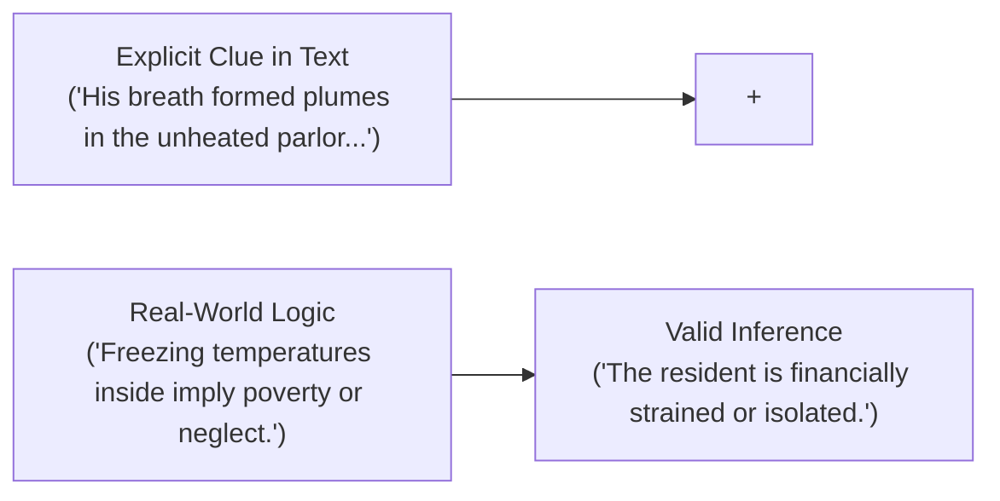

# Day 64 : Reading Comprehension: Inference & Author's Tone

## 📚 Overview
Literary fiction, editorial journalism, and executive discourse often convey their most profound messages **between the lines**. Authors rarely spell out every emotional state or underlying motive explicitly; instead, they embed subtle clues through **sensory diction**, **syntactic rhythm**, and **symbolic choices**. Today’s lesson explores the dual arts of **drawing valid inferences** (deducing what is implied without overreaching) and **analyzing the author's tone** (identifying the emotional attitude toward the subject matter) through the evocative short story: *The Winter Crossroads*.

---

## 🎯 Learning Objectives
By the end of this lesson, you will be able to:
- Formulate textually grounded **inferences** using the formula: `Textual Evidence + Prior Knowledge = Valid Inference`.
- Avoid common inference fallacies (overgeneralization, baseless speculation, projection).
- Decode an author's **tone** by analyzing diction (word choice), figurative language, and sentence pacing.
- Distinguish between closely aligned tone adjectives (*melancholic vs. cynical*, *objective vs. ambivalent*, *nostalgic vs. somber*).

---

## 📖 Theoretical Breakdown

### 1. The Anatomy of an Inference

#### What an Inference IS and IS NOT:
- **IS:** A logical, unavoidable conclusion derived directly from facts provided by the author.
- **IS NOT:** A wild guess, fantasy projection, or assumption unsupported by textual evidence.
- *Example:* If a character clutches a faded photograph, stares out a rain-streaked window for an hour, and refuses dinner, you can infer **grief or longing**; you cannot infer that the person in the photograph died in a car accident unless the text supports it.

---

### 2. The Author's Tone Matrix

Tone describes the author's **attitude toward the subject, characters, or audience**. It is revealed through **connotative diction** (words with emotional weight):

| Tone Classification | Emotional Spectrum | Key Linguistic Signifiers | Example Sentence |
| :--- | :--- | :--- | :--- |
| **Melancholic / Somber** | Sorrowful, pensive, mourning | *drab, hollow, faded, lingering, quiet, cold* | *"The antique clock ticked slowly, counting hours in an empty room."* |
| **Nostalgic** | Wistful longing for the past | *golden, reminiscent, tender, cherished, echoes* | *"The faint aroma of cedar brought back long-forgotten summers."* |
| **Cynical / Sardonic** | Distrustful, mocking, disillusioned | *farce, hollow promise, naive, predictably* | *"The politician smiled warmly, calculating the cost of each vote."* |
| **Ambivalent** | Torn between contradictory feelings | *yet, on one hand, hesitation, conflicted, unsettled* | *"She accepted the promotion, yet felt a quiet ache for the life she left behind."* |
| **Objective / Detached** | Impartial, factual, scientific | *observed, recorded, indicated, data shows* | *"The specimen exhibited a 14% decrease in mass under controlled pressure."* |

---

### 3. The Short Story: *The Winter Crossroads*

> **Paragraph 1:**  
> The locomotive exhaled a final shudder of steam before grinding to a halt against the snowbound platform of Oakhaven Station. Margaret stood motionless, her woolen gloved fingers tracing the edge of an unopened envelope inside her coat pocket. The postmark read *November 3rd*, its ink smeared by six weeks of transit across the Atlantic. Overhead, the zinc roof groaned beneath the weight of gathering sleet, while the stationmaster extinguished the oil lanterns one by one, cloaking the wooden platform in deepening dusk.
>
> **Paragraph 2:**  
> Ten years earlier, the platform had echoed with laughter, brass trumpets, and brass-buttoned coats. Today, the ticket booth was boarded shut, and wild brambles poked through the split timber of the waiting benches. She took three slow steps toward the carriage road. Through the swirling white blizzard, two faint yellow beams of light cut through the gloom: Thomas’s rusted flatbed truck was idling by the mile-marker, its exhaust rattling like dry bones in the biting wind.
>
> **Paragraph 3:**  
> Margaret did not hurry. She pulled her woolen collar higher against the sub-zero squall and looked back once at the empty iron tracks receding into the darkness. She knew that if she climbed into the passenger seat of that rattling truck, the envelope would never need to be opened—its unanswered questions buried forever beneath the drift. Taking a deep, frosted breath that burned her throat, she stepped off the platform into the virgin snow.

---

## 💬 Conversational Dialogue

**Context:** Clara (Literature Teacher) and Sam (Student) analyze tone and character psychology in *The Winter Crossroads*.

- **Sam:** "Clara, does the author ever explicitly say that Margaret is sad?"
- **Clara:** "Not once! The word 'sad' never appears. But what words does the author choose to describe the setting?"
- **Sam:** "Words like *'groaned beneath gathering sleet'*, *'deepening dusk'*, *'boarded shut'*, and *'rattling like dry bones'*."
- **Clara:** "Exactly. Those are visceral, melancholic word choices. What do they tell you about the town and Margaret's emotional state?"
- **Sam:** "The town has decayed, and Margaret feels like she is at a somber, irreversible turning point in her life."
- **Clara:** "That's a textbook inference! And what can we infer about the letter in her pocket?"
- **Sam:** "It represents a different life or a decision she ran away from. If she gets in Thomas's truck, she is choosing to leave that past unopened and unresolved."
- **Clara:** "Magnificent, Sam! You didn't just read the sentences; you inferred the subtext through imagery and tone."

---

## ✍️ Practice Exercises

### Exercise 1: Inference Deduction
Answer the following questions based on clues in *The Winter Crossroads*:
1. Why were the oil lanterns being extinguished one by one in Paragraph 1? What does this imply about the time of day and station activity?
2. What happened to the town of Oakhaven over the past ten years? What visual evidence supports this?
3. What is the symbolic significance of Margaret's action in stepping off the platform into the virgin snow?

### Exercise 2: Tone Analysis
Select the three adjectives that best characterize the overall tone of the short story:
- [ ] Whimsical
- [ ] Melancholic
- [ ] Somber
- [ ] Celebratory
- [ ] Pensive
- [ ] Sarcastic

---

## 🔑 Self-Check Answer Key

### Exercise 1:
1. *Inference:* It is evening or nightfall, and the station is closing down because the train was the last arrival of the day; the station itself is dying and sees minimal passengers.
2. *Inference:* The town has suffered severe economic decline or depopulation. Clues: the ticket booth is boarded shut, benches are split with wild brambles, and the celebratory brass-buttoned coats of ten years ago are gone.
3. *Inference:* Stepping into "virgin snow" symbolizes crossing an irreversible threshold into a new, uncertain future, deliberately choosing to leave her past behind.

### Exercise 2:
**Correct Selections:** **Melancholic**, **Somber**, and **Pensive**.  
(The imagery emphasizes decay, fading light, coldness, and heavy internal contemplation).

---

## 💡 Practical Tip for Daily Practice
> **The Emotional Adjective Scan:** When reading any editorial or fiction passage, circle three descriptive adjectives or similes used by the author (e.g., *"rattling like dry bones"*). Ask yourself: *What emotion does this image evoke? Is it warm, ominous, mocking, or clinical?* Identifying the emotional charge of three key words will instantly reveal the author's overarching tone.
