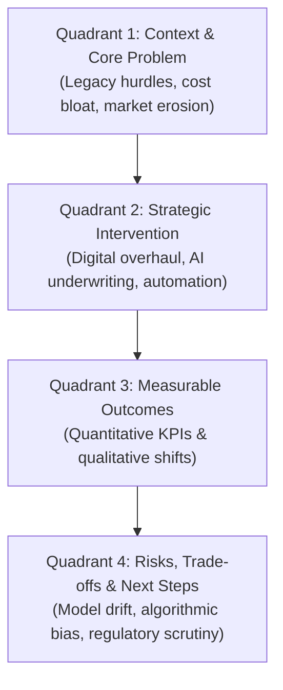

# Day 65 : Reading Comprehension: Business Case Study

## 📚 Overview
Business case studies are the primary analytical format used across executive MBA programs, management consulting, and corporate boardroom strategy. Unlike linear narratives or purely theoretical essays, case studies demand **cross-dimensional reading**: you must synthesize quantitative metrics (margins, customer churn, latency rates) alongside qualitative human realities (cultural resistance, regulatory compliance, brand trust). Today’s lesson breaks down the **Case Study Analytical Matrix** through the corporate transformation of *OmniBank Group*.

---

## 🎯 Learning Objectives
By the end of this lesson, you will be able to:
- Deconstruct complex business case studies into four core quadrants: **Context/Problem**, **Strategic Intervention**, **Measurable Outcomes**, and **Systemic Risks/Trade-offs**.
- Interpret corporate performance metrics and financial terminology in written English (*CAC, churn, basis points, credit underwriting, latency*).
- Extract implicit strategic trade-offs between speed-to-market and regulatory compliance.
- Formulate executive-level business recommendations based on case evidence.

---

## 📖 Theoretical Breakdown

### 1. The 4-Quadrant Case Study Analytical Matrix

| Quadrant | Key Analytical Question | What to Search For in the Text | High-Frequency Business Collocations |
| :--- | :--- | :--- | :--- |
| **1. The Problem** | What operational failure or market shift triggered the crisis? | Legacy technology, high customer acquisition cost (CAC), churn, falling net interest margins. | *market erosion, operational friction, bloated cost structure, legacy debt* |
| **2. The Intervention** | What strategic initiative did leadership implement? | Technology stack migration, AI automation, organizational restructuring. | *phased rollout, agile restructuring, algorithmic credit scoring, end-to-end automation* |
| **3. The Results** | Did the intervention solve the problem quantitatively and qualitatively? | Changes in processing time, operating expense ratios, revenue growth, satisfaction scores (CSAT). | *basis points, latency reduction, customer retention, EBITDA expansion* |
| **4. The Trade-offs** | What new vulnerabilities, regulatory risks, or moral hazards emerged? | Bias, security vulnerabilities, regulatory compliance challenges, workforce friction. | *algorithmic bias, model explainability, regulatory scrutiny, technical debt* |

---

### 2. The Case Study Passage: *Fintech Transformation & AI Adoption at OmniBank*

> **Paragraph 1: The Incumbent’s Dilemma**  
> In early 2023, OmniBank Group—a century-old multinational financial institution with $180 billion in assets under management—faced an alarming erosion of market share among millennials and Gen-Z consumers. Neobanks and agile fintech startups were capturing 38% of new retail checking accounts by offering zero-fee transfers and instant automated loan approvals. OmniBank’s legacy retail lending process, which relied on decentralized regional loan officers and manual document audits, suffered an average loan turnaround time of 9.2 days, yielding a disheartening 42% application abandonment rate. Furthermore, manual processing costs averaged $420 per micro-loan, rendering small-ticket lending economically unviable.
>
> **Paragraph 2: The Strategic AI Overhaul**  
> Under newly appointed Chief Technology Officer Sophia Sterling, OmniBank initiated a radical two-pronged modernization roadmap dubbed *Project Archimedes*. First, the bank dismantled its siloed COBOL mainframes, migrating core operations to an elastic hybrid cloud infrastructure. Second, Sterling integrated an ensemble machine-learning model trained on ten years of anonymized historical repayment data alongside real-time behavioral cash-flow telemetry. By analyzing alternative underwriting signals—such as utility billing consistency and merchant transaction velocity—the algorithmic pipeline was capable of rendering credit decisions in less than 4 seconds.
>
> **Paragraph 3: Empirical Outcomes and Emergent Risks**  
> Within 14 months of deployment, *Project Archimedes* transformed OmniBank’s retail division. Loan processing latency plunged by 99.8%, and the application abandonment rate dropped from 42% to 6.5%. Cost-to-originate per micro-loan shrank from $420 down to $28, generating an annualized operational savings of $84 million. However, the transformation introduced complex governance vulnerabilities. In Q2 2024, an independent algorithmic audit revealed that the credit model exhibited a statistically significant 4.8% disparate impact against gig-economy applicants with variable income streams. Facing regulatory inquiry from the Consumer Financial Protection Bureau (CFPB), OmniBank was forced to implement an explainable AI (XAI) human-in-the-loop review mechanism, illustrating that algorithmic velocity must never outpace ethical compliance.

---

## 💬 Conversational Dialogue

**Context:** Mark (Management Consultant) and Rachel (Senior Strategy Director) analyze OmniBank’s case during a post-mortem debrief.

- **Mark:** "Rachel, looking at *Project Archimedes*, the numbers are extraordinary—reducing loan decision latency from 9.2 days down to four seconds is an engineering triumph."
- **Rachel:** "From an efficiency perspective, absolutely. They brought operating costs down by over 93% per micro-loan."
- **Mark:** "Yet the CFPB audit in Paragraph 3 exposes a classic strategic blind spot."
- **Rachel:** "Precisely. The model prioritized historical repayment telemetry without accounting for structural income irregularities in gig-economy workers. When you automate at scale, you also automate systemic bias at scale."
- **Mark:** "What's the executive takeaway for other traditional banks pursuing fintech adoption?"
- **Rachel:** "Velocity is meaningless if your algorithmic pipeline triggers regulatory penalties and brand reputational damage. The smartest fintech strategy balances automated machine learning with transparent human oversight."

---

## ✍️ Practice Exercises

### Exercise 1: Quantitative Data Extraction
Using the case study, fill in the exact business metrics:
1. OmniBank's assets under management: ________________
2. Original loan turnaround time vs. New turnaround time: ________________ vs. ________________
3. Original micro-loan origination cost vs. New origination cost: ________________ vs. ________________
4. Application abandonment rate reduction: from ________________ down to ________________
5. Annualized operational savings generated: ________________

### Exercise 2: Strategic Trade-Off Analysis
In 2 to 3 sentences, explain why OmniBank was forced to introduce a human-in-the-loop explainable AI (XAI) mechanism despite the massive success of their automated pipeline.

---

## 🔑 Self-Check Answer Key

### Exercise 1: Metrics
1. **$180 billion** (Paragraph 1)
2. **9.2 days** vs. **less than 4 seconds** (Paragraph 1 & 2)
3. **$420** vs. **$28** (Paragraph 1 & 3)
4. From **42%** down to **6.5%** (Paragraph 1 & 3)
5. **$84 million** (Paragraph 3)

### Exercise 2: Strategic Trade-Off Analysis
*Sample Answer:* An independent algorithmic audit uncovered that the automated credit-scoring model caused a 4.8% disparate impact against variable-income gig workers, provoking an inquiry from regulatory authorities (CFPB). OmniBank had to institute a human-in-the-loop XAI review mechanism to ensure ethical transparency, regulatory compliance, and non-discriminatory lending practices.

---

## 💡 Practical Tip for Daily Practice
> **The Case Study Executive Summary Drill:** Whenever you read an article in the *Financial Times*, *The Wall Street Journal*, or *Harvard Business Review*, summarize it in four concise bullet points: (1) Problem, (2) Strategic Action, (3) Metric Proof, and (4) Unintended Consequence. This structure trains your brain to think and communicate like a senior business leader.
